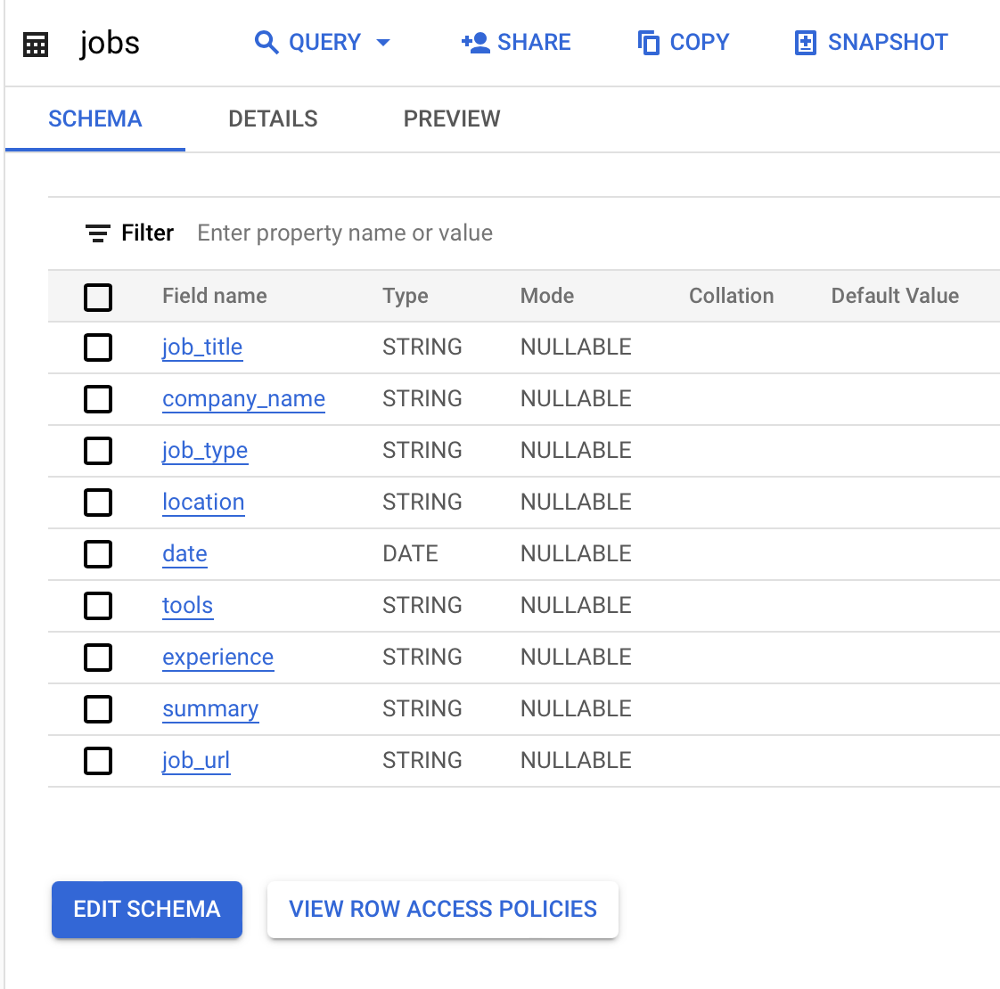
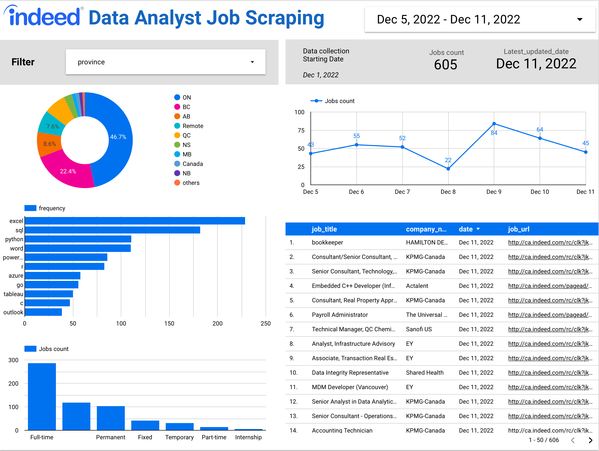

# Indeed_Job_Scraping
The dashboard can be found [here.](https://datastudio.google.com/s/rAkYW5odUMM)

## Introduction
I am interested in understanding the current trends and demands in the data analysis field, specifically with regard to the languages, cloud platforms, and tools that are commonly mentioned in job postings. To gather this information, I plan to scrape Indeed for job postings related to data analysis in Canada and use the scraped data to generate insights and visualizations using BigQuery.

## Objective
The main objective of this project is to build a web scraper in Python that can collect job postings from Indeed and automatically upload the data to BigQuery. Once the data is in BigQuery, I will use data exploration and visualization techniques to gain insights on the technologies and skills that are in demand in the data analysis job market in Canada.

## Data 
The data for this project will be collected using the keyword "data analysis" and the location "Canada". The scraped data will include the following information from the postings.

  

## Visualization 
To gain insights from the data, I will use a tool such as Data Studio to create interactive visualizations. The dashboard will be automatically updated daily and will help identify the most common languages, platforms, and tools mentioned in the job postings, providing a better understanding of the job market in Canada.

  

## Conclusion
 The project will provide a valuable resource for job seekers studying the job market and technology trends in the field of data analysis. By using BigQuery and data visualization tools, the project will allow for easy exploration and analysis of the scraped data, providing insights that may not be immediately apparent from just reading through the job postings. Overall, the project has the potential to provide valuable insights and information to a variety of audiences.

